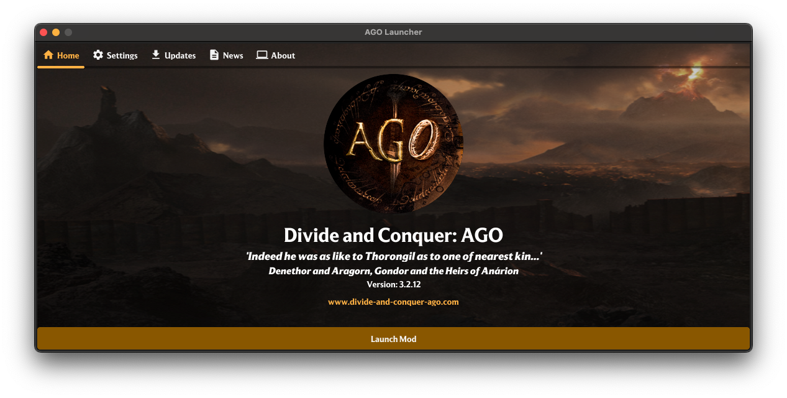
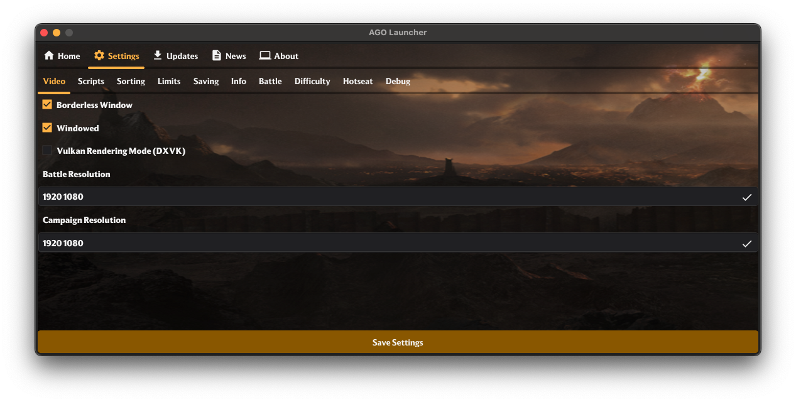
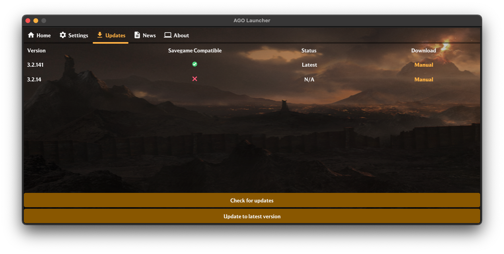
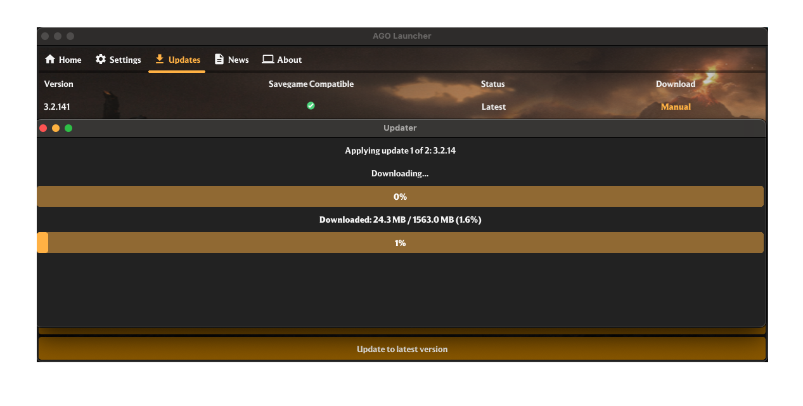

<h1 align="center" style="color:#bf6f00;">
  <a href="https://www.divide-and-conquer-ago.com">Divide and Conquer: AGO Launcher</a>
</h1>

<div align="center">
  <a href="https://discord.gg/yVHm7kBTAY">
    
  </a>
  <div>
    
    
    
    
  </div>
</div>

-----------------
## Development
0. Install [Go](https://go.dev/doc/install) and [Fyne](https://docs.fyne.io/started/)
1. Install `air` for hot reload support

```shell
go install github.com/air-verse/air@latest
```

2. Start the project

```shell
cd src 
air
```

This will build the binary (AGO_Launcher.exe) and run it from `resources/mods/ago_beta` where there are various config files and example folders to use

If you want to test it on an actual mod folder in it's packaged state, you can run

```shell
cd src
fyne package -release -os windows && xcopy /Y "AGO_Launcher.exe" "E:\Steam\steamapps\common\Medieval II Total War\mods\ago_beta\AGO_Launcher.exe" &&"E:\Steam\steamapps\common\Medieval II Total War\mods\ago_beta\AGO_Launcher.exe"
```